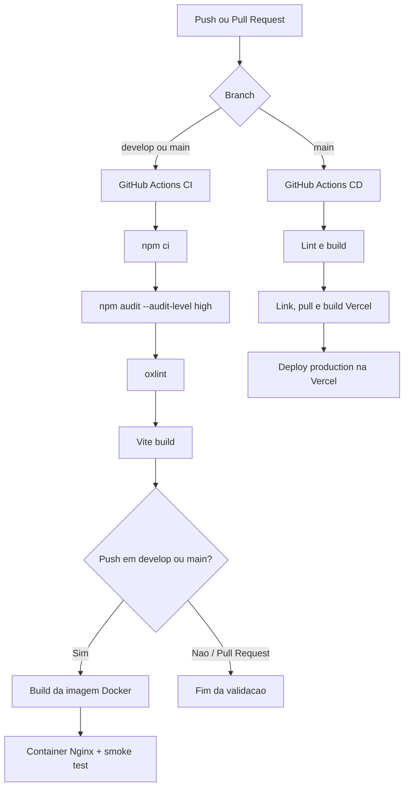

# Pipeline Lab

Aplicacao frontend criada para demonstrar um fluxo de CI/CD com React, Vite, Docker, GitHub Actions e Vercel. A interface exibe o estado do deployment e identifica se o bundle esta rodando localmente ou em um ambiente Vercel.

## Sumario

- [Visao geral](#visao-geral)
- [Arquitetura](#arquitetura)
- [Pre-requisitos](#pre-requisitos)
- [Execucao local](#execucao-local)
- [Comandos disponiveis](#comandos-disponiveis)
- [CI](#ci)
- [CD e deploy na Vercel](#cd-e-deploy-na-vercel)
- [Docker](#docker)
- [Estrutura do repositorio](#estrutura-do-repositorio)
- [Troubleshooting](#troubleshooting)

## Visao geral

O projeto usa uma aplicacao React pequena e um pipeline com duas responsabilidades:

1. **CI (Continuous Integration):** valida pull requests e pushes em `develop` e `main`.
2. **CD (Continuous Delivery/Deployment):** publica automaticamente em producao na Vercel quando existe um push em `main`.

O fluxo recomendado e desenvolver em `develop`, abrir um pull request para `main` e fazer o merge somente depois que as verificacoes do CI forem aprovadas.

## Arquitetura



### Camadas da aplicacao

- **React:** `src/App.jsx` renderiza o painel de deployment e `src/main.jsx` monta a aplicacao no elemento `#root`.
- **Vite:** transforma o codigo React em arquivos estaticos no diretorio `dist`.
- **Docker:** usa um build multi-stage. A primeira imagem executa o build com Node.js; a segunda serve `dist` com Nginx.
- **Nginx:** entrega os arquivos estaticos e redireciona rotas desconhecidas para `index.html`, permitindo fallback de aplicacoes SPA.
- **Vercel:** recebe o build pre-built gerado pelo CLI da Vercel no workflow de CD.
- **API de deployment:** `api/deployment.js` consulta o ultimo deployment de producao pela API da Vercel. O frontend atualiza essa coleta a cada 15 segundos sem expor o token.

Durante o build, `vite.config.js` injeta valores globais no frontend:

| Valor | Origem | Uso |
| --- | --- | --- |
| `__IS_VERCEL__` | `process.env.VERCEL === '1'` | Indica se o bundle foi gerado pela Vercel. |
| `__VERCEL_ENV__` | `process.env.VERCEL_ENV` | Exibe o ambiente Vercel atual. |
| `__DEPLOY_VERSION__` | `VERCEL_GIT_COMMIT_SHA` ou `local` | Identifica o commit do deployment. |
| `__VERCEL_GIT_COMMIT_REF__` | `VERCEL_GIT_COMMIT_REF` ou `local` | Identifica a branch do deployment. |
| `__BUILD_TIMESTAMP__` | Relogio do processo de build | Fallback local quando a API da Vercel nao esta disponivel. |

Os valores de build sao estaticos. Em producao, status, inicio, fim e duracao do deployment vem de `/api/deployment`, que consulta os dados atuais da Vercel.

## Pre-requisitos

- Node.js 20 ou superior.
- npm, incluido na instalacao do Node.js.
- Git.
- Docker Desktop, apenas para executar ou validar a imagem localmente.
- Acesso ao repositorio GitHub e a um projeto Vercel para configurar o deploy automatico.

## Execucao local

Instale as dependencias usando o lockfile:

```bash
npm ci
```

Inicie o servidor de desenvolvimento:

```bash
npm run dev
```

O Vite exibira a URL local, normalmente `http://localhost:5173`.

Para testar o build de producao sem Docker:

```bash
npm run build
npm run preview
```

O comando `preview` serve o conteudo de `dist` localmente e nao substitui o servidor Nginx da imagem Docker.

## Comandos disponiveis

| Comando | Finalidade |
| --- | --- |
| `npm ci` | Instala exatamente as versoes do `package-lock.json`. |
| `npm run dev` | Inicia o servidor de desenvolvimento do Vite. |
| `npm run lint` | Executa o Oxlint. |
| `npm run build` | Gera o bundle de producao em `dist`. |
| `npm run preview` | Serve localmente o bundle gerado. |
| `npm audit --audit-level=high` | Falha quando encontra vulnerabilidades de severidade alta ou critica. |

O projeto nao possui atualmente um script `test`; por isso o CI usa `npm test --if-present` e apenas executa testes se esse script for adicionado ao `package.json`.

## CI

O workflow esta em `.github/workflows/ci.yaml` e roda no Ubuntu com Node.js 20.

### Quando executa

- Pull requests direcionados para `develop` ou `main`.
- Pushes em `develop` ou `main`.

O workflow usa concorrencia por workflow e referencia e cancela execucoes anteriores ainda pendentes da mesma referencia.

### Job `validate`

Executa, nesta ordem:

1. Checkout do repositorio.
2. Configuracao do Node.js 20 com cache do npm.
3. `npm ci`.
4. `npm audit --audit-level=high`.
5. `npm run lint --if-present`.
6. `npm test --if-present`.
7. `npm run build`.

O job precisa terminar com sucesso antes que o job Docker seja iniciado.

### Job `docker`

Executa somente em pushes para `develop` ou `main`, nunca em pull requests. Ele:

1. Constroi a imagem com `docker build --pull`.
2. Inicia o container na porta `8080` do runner, mapeada para a porta `80` do Nginx.
3. Aguarda a inicializacao do servidor.
4. Executa `curl` com tentativas automaticas contra `http://localhost:8080/`.
5. Remove o container ao final, inclusive em caso de falha.

## CD e deploy na Vercel

O workflow esta em `.github/workflows/cd.yaml` e executa somente em pushes para `main`. O job usa o ambiente GitHub `production` e nao permite cancelar um deploy de producao em andamento.

### Etapas do deploy

1. Checkout do commit enviado para `main`.
2. Configuracao do Node.js 20 e cache do npm.
3. Instalacao com `npm ci`.
4. Validacao com lint e `npm run build`.
5. Verificacao da existencia das credenciais da Vercel.
6. Remocao de configuracao local anterior em `.vercel`.
7. Vinculacao do repositorio ao projeto Vercel com `vercel link`.
8. Download das configuracoes de producao com `vercel pull`.
9. Preparacao do build com `vercel build --prod`.
10. Publicacao do artefato pre-built com `vercel deploy --prebuilt --prod`.

### Secrets necessarios

Configure os seguintes secrets no ambiente GitHub `production`:

| Secret | Descricao |
| --- | --- |
| `VERCEL_TOKEN` | Token de autenticacao da CLI da Vercel. |
| `VERCEL_ORG_ID` | ID da conta ou time que possui o projeto. |
| `VERCEL_PROJECT_ID` | ID do projeto Vercel que recebera o deploy. |

As credenciais sao usadas apenas pelo runner e nao devem ser adicionadas ao repositorio, ao `.env` versionado ou ao frontend.

### Configuracao na Vercel

1. Crie ou importe um projeto na Vercel.
2. Obtenha o `Project ID` nas configuracoes do projeto.
3. Obtenha o ID da conta ou time no painel da Vercel.
4. Gere um token com permissao suficiente para vincular e publicar o projeto.
5. Cadastre os tres valores como secrets do ambiente `production` no repositorio GitHub.
6. No projeto Vercel, cadastre `VERCEL_API_TOKEN`, `VERCEL_PROJECT_ID` e, se o projeto pertencer a um time, `VERCEL_ORG_ID` como variaveis de ambiente de producao. A funcao `api/deployment.js` usa essas variaveis em runtime.
7. Faça merge em `main` ou envie um commit diretamente para essa branch.

### Coleta em tempo real

Quando publicado na Vercel, o painel chama `GET /api/deployment` ao abrir e a cada 15 segundos. A resposta fornece o status atual, branch, commit, horario de criacao, inicio do build e horario em que o deployment ficou pronto.

No desenvolvimento local e na imagem Docker, essa funcao serverless nao e executada pelo Nginx. Nesse caso, a tela mostra os metadados do build e deixa o status da API indisponivel, sem fabricar horarios de etapas.

## Docker

O `Dockerfile` usa duas etapas para manter a imagem final enxuta:

1. `node:20-alpine`: instala dependencias e executa `npm run build`.
2. `nginx:1.27-alpine`: copia apenas `dist` e a configuracao do Nginx.

Para construir e executar localmente:

```bash
docker build --pull --tag pipeline-lab .
docker run --detach --name pipeline-lab --publish 8080:80 pipeline-lab
```

Acesse `http://localhost:8080`. Para parar e remover o container:

```bash
docker rm --force pipeline-lab
```

O arquivo `.dockerignore` exclui `node_modules`, `dist`, `.git`, `.github` e logs do contexto enviado ao daemon Docker.

## Estrutura do repositorio

```text
.
├── .github/workflows/
│   ├── ci.yaml              # Lint, auditoria, build e smoke test Docker
│   └── cd.yaml              # Build e deploy de producao na Vercel
├── api/
│   └── deployment.js        # Consulta o ultimo deployment na API da Vercel
├── public/                  # Arquivos estaticos publicos
├── src/
│   ├── assets/              # Imagens e assets usados pela aplicacao
│   ├── App.jsx              # Interface principal do painel
│   ├── App.css              # Estilos da interface
│   ├── index.css            # Estilos globais
│   └── main.jsx             # Ponto de entrada React
├── .dockerignore            # Arquivos excluidos do contexto Docker
├── Dockerfile               # Build multi-stage e imagem Nginx
├── index.html               # HTML base do Vite
├── nginx.conf               # Servidor estatico e fallback SPA
├── package.json             # Scripts e dependencias
├── package-lock.json        # Versoes exatas das dependencias
└── vite.config.js           # Plugin React e variaveis de build
```

## Troubleshooting

### `npm ci` falha

Confirme que o Node.js e o npm estao instalados e que o `package-lock.json` acompanha o `package.json`. Evite usar `npm install` para corrigir o CI sem revisar as alteracoes no lockfile.

### O lint falha localmente, mas nao deveria

Execute `npm run lint` na raiz do repositorio e corrija os arquivos apontados pelo Oxlint. O CI usa a mesma versao instalada pelo lockfile.

### A imagem Docker sobe, mas a pagina nao abre

Confirme se a porta `8080` esta livre e se o container esta em execucao:

```bash
docker ps
docker logs pipeline-lab
```

Tambem verifique se a porta foi publicada com `--publish 8080:80`.

### O deploy da Vercel nao inicia

O CD so e disparado por pushes em `main`. Verifique tambem se os tres secrets estao configurados no ambiente `production`, se os IDs pertencem ao mesmo projeto e se o token ainda esta valido.

### O deploy falha em `vercel link` ou `vercel pull`

Confirme `VERCEL_ORG_ID`, `VERCEL_PROJECT_ID` e `VERCEL_TOKEN`. O workflow remove `.vercel` antes de vincular o projeto para evitar configuracoes antigas no runner.

